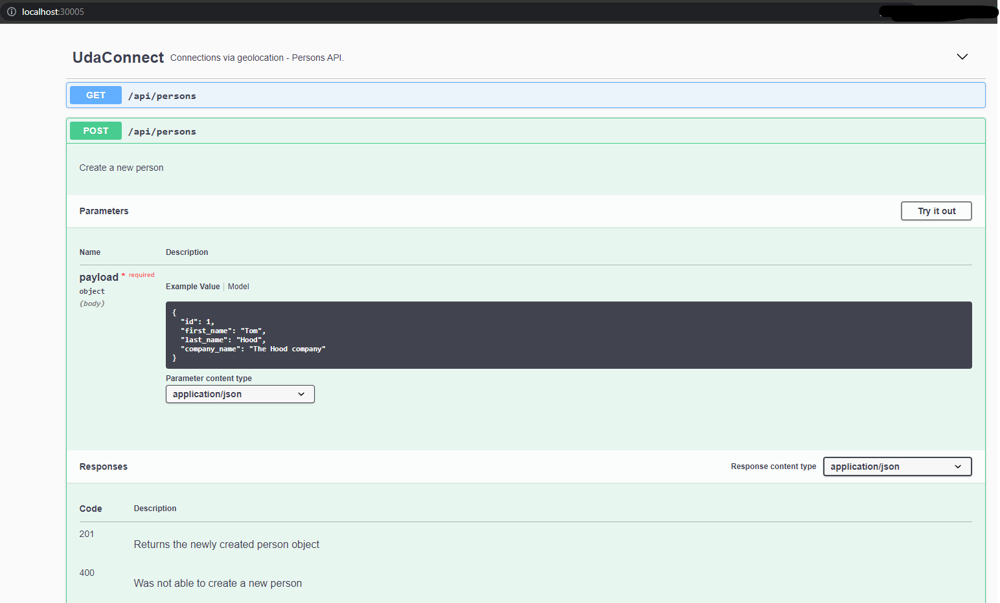

# UdaConnect
## Overview
### Background
Conferences and conventions are hotspots for making connections. Professionals in attendance often share the same interests and can make valuable business and personal connections with one another. At the same time, these events draw a large crowd and it's often hard to make these connections in the midst of all of these events' excitement and energy. To help attendees make connections, we are building the infrastructure for a service that can inform attendees if they have attended the same booths and presentations at an event.

### Goal
You work for a company that is building a app that uses location data from mobile devices. Your company has built a [POC](https://en.wikipedia.org/wiki/Proof_of_concept) application to ingest location data named UdaTracker. This POC was built with the core functionality of ingesting location and identifying individuals who have shared a close geographic proximity.

Management loved the POC so now that there is buy-in, we want to enhance this application. You have been tasked to enhance the POC application into a [MVP](https://en.wikipedia.org/wiki/Minimum_viable_product) to handle the large volume of location data that will be ingested.

To do so, ***you will refactor this application into a microservice architecture using message passing techniques that you have learned in this course***. It’s easy to get lost in the countless optimizations and changes that can be made: your priority should be to approach the task as an architect and refactor the application into microservices. File organization, code linting -- these are important but don’t affect the core functionality and can possibly be tagged as TODO’s for now!

### Technologies
* [Flask](https://flask.palletsprojects.com/en/1.1.x/) - API webserver
* [SQLAlchemy](https://www.sqlalchemy.org/) - Database ORM
* [PostgreSQL](https://www.postgresql.org/) - Relational database
* [PostGIS](https://postgis.net/) - Spatial plug-in for PostgreSQL enabling geographic queries]
* [Vagrant](https://www.vagrantup.com/) - Tool for managing virtual deployed environments
* [VirtualBox](https://www.virtualbox.org/) - Hypervisor allowing you to run multiple operating systems
* [K3s](https://k3s.io/) - Lightweight distribution of K8s to easily develop against a local cluster

## Running the app
The project has been set up such that you should be able to have the project up and running with Kubernetes.

### Prerequisites
We will be installing the tools that we'll need to use for getting our environment set up properly.
1. [Install Docker](https://docs.docker.com/get-docker/)
2. [Set up a DockerHub account](https://hub.docker.com/)
3. [Set up `kubectl`](https://rancher.com/docs/rancher/v2.x/en/cluster-admin/cluster-access/kubectl/)
4. [Install VirtualBox](https://www.virtualbox.org/wiki/Downloads) with at least version 6.0
5. [Install Vagrant](https://www.vagrantup.com/docs/installation) with at least version 2.0

### Environment Setup
To run the application, you will need a K8s cluster running locally and to interface with it via `kubectl`. We will be using Vagrant with VirtualBox to run K3s.

#### Initialize K3s
In this project's root, run `vagrant up`.
```bash
$ vagrant up
```
The command will take a while and will leverage VirtualBox to load an [openSUSE](https://www.opensuse.org/) OS and automatically install [K3s](https://k3s.io/). When we are taking a break from development, we can run `vagrant suspend` to conserve some ouf our system's resources and `vagrant resume` when we want to bring our resources back up. Some useful vagrant commands can be found in [this cheatsheet](https://gist.github.com/wpscholar/a49594e2e2b918f4d0c4).

#### Set up `kubectl`
After `vagrant up` is done, you will SSH into the Vagrant environment and retrieve the Kubernetes config file used by `kubectl`. We want to copy the contents of this file into our local environment so that `kubectl` knows how to communicate with the K3s cluster.
```bash
$ vagrant ssh
```
You will now be connected inside of the virtual OS. Run `sudo cat /etc/rancher/k3s/k3s.yaml` to print out the contents of the file. You should see output similar to the one that I've shown below. Note that the output below is just for your reference: every configuration is unique and you should _NOT_ copy the output I have below.

Copy the contents from the output issued from your own command into your clipboard -- we will be pasting it somewhere soon!
```bash
$ sudo cat /etc/rancher/k3s/k3s.yaml

apiVersion: v1
clusters:
- cluster:
    certificate-authority-data: LS0tLS1CRUdJTiBDRVJUSUZJQ0FURS0tLS0tCk1JSUJWekNCL3FBREFnRUNBZ0VBTUFvR0NDcUdTTTQ5QkFNQ01DTXhJVEFmQmdOVkJBTU1HR3N6Y3kxelpYSjIKWlhJdFkyRkFNVFU1T1RrNE9EYzFNekFlRncweU1EQTVNVE13T1RFNU1UTmFGdzB6TURBNU1URXdPVEU1TVROYQpNQ014SVRBZkJnTlZCQU1NR0dzemN5MXpaWEoyWlhJdFkyRkFNVFU1T1RrNE9EYzFNekJaTUJNR0J5cUdTTTQ5CkFnRUdDQ3FHU000OUF3RUhBMElBQk9rc2IvV1FEVVVXczJacUlJWlF4alN2MHFseE9rZXdvRWdBMGtSN2gzZHEKUzFhRjN3L3pnZ0FNNEZNOU1jbFBSMW1sNXZINUVsZUFOV0VTQWRZUnhJeWpJekFoTUE0R0ExVWREd0VCL3dRRQpBd0lDcERBUEJnTlZIUk1CQWY4RUJUQURBUUgvTUFvR0NDcUdTTTQ5QkFNQ0EwZ0FNRVVDSVFERjczbWZ4YXBwCmZNS2RnMTF1dCswd3BXcWQvMk5pWE9HL0RvZUo0SnpOYlFJZ1JPcnlvRXMrMnFKUkZ5WC8xQmIydnoyZXpwOHkKZ1dKMkxNYUxrMGJzNXcwPQotLS0tLUVORCBDRVJUSUZJQ0FURS0tLS0tCg==
    server: https://127.0.0.1:6443
  name: default
contexts:
- context:
    cluster: default
    user: default
  name: default
current-context: default
kind: Config
preferences: {}
users:
- name: default
  user:
    password: 485084ed2cc05d84494d5893160836c9
    username: admin
```
Type `exit` to exit the virtual OS and you will find yourself back in your computer's session. Create the file (or replace if it already exists) `~/.kube/config` and paste the contents of the `k3s.yaml` output here.

Afterwards, you can test that `kubectl` works by running a command like `kubectl describe services`. It should not return any errors.

### Steps
1. `kubectl apply -f deployment/db-configmap.yaml` - Set up environment variables for the pods
2. `kubectl apply -f deployment/db-secret.yaml` - Set up secrets for the pods
3. `kubectl apply -f deployment/postgres.yaml` - Set up a Postgres database running PostGIS
4. `kubectl apply -f deployment/udaconnect-api.yaml` - Set up the service and deployment for the API
5. `kubectl apply -f deployment/udaconnect-app.yaml` - Set up the service and deployment for the web app
6. `sh scripts/run_db_command.sh <POD_NAME>` - Seed your database against the `postgres` pod. (`kubectl get pods` will give you the `POD_NAME`)

Manually applying each of the individual `yaml` files is cumbersome but going through each step provides some context on the content of the starter project. In practice, we would have reduced the number of steps by running the command against a directory to apply of the contents: `kubectl apply -f deployment/`.

Note: The first time you run this project, you will need to seed the database with dummy data. Use the command `sh scripts/run_db_command.sh <POD_NAME>` against the `postgres` pod. (`kubectl get pods` will give you the `POD_NAME`). Subsequent runs of `kubectl apply` for making changes to deployments or services shouldn't require you to seed the database again!

### Verifying it Works
Once the project is up and running, you should be able to see 3 deployments and 3 services in Kubernetes:
`kubectl get pods` and `kubectl get services` - should both return `udaconnect-app`, `udaconnect-api`, and `postgres`


These pages should also load on your web browser:
* `http://localhost:30001/` - OpenAPI Documentation
* `http://localhost:30001/api/` - Base path for API
* `http://localhost:30000/` - Frontend ReactJS Application

#### Deployment Note
You may notice the odd port numbers being served to `localhost`. [By default, Kubernetes services are only exposed to one another in an internal network](https://kubernetes.io/docs/concepts/services-networking/service/). This means that `udaconnect-app` and `udaconnect-api` can talk to one another. For us to connect to the cluster as an "outsider", we need to a way to expose these services to `localhost`.

Connections to the Kubernetes services have been set up through a [NodePort](https://kubernetes.io/docs/concepts/services-networking/service/#nodeport). (While we would use a technology like an [Ingress Controller](https://kubernetes.io/docs/concepts/services-networking/ingress-controllers/) to expose our Kubernetes services in deployment, a NodePort will suffice for development.)

## Development
### New Services
New services can be created inside of the `modules/` subfolder. You can choose to write something new with Flask, copy and rework the `modules/api` service into something new, or just create a very simple Python application.

As a reminder, each module should have:
1. `Dockerfile`
2. Its own corresponding DockerHub repository
3. `requirements.txt` for `pip` packages
4. `__init__.py`

### Docker Images
`udaconnect-app` and `udaconnect-api` use docker images from `udacity/nd064-udaconnect-app` and `udacity/nd064-udaconnect-api`. To make changes to the application, build your own Docker image and push it to your own DockerHub repository. Replace the existing container registry path with your own.

## Configs and Secrets
In `deployment/db-secret.yaml`, the secret variable is `d293aW1zb3NlY3VyZQ==`. The value is simply encoded and not encrypted -- this is ***not*** secure! Anyone can decode it to see what it is.
```bash
# Decodes the value into plaintext
echo "d293aW1zb3NlY3VyZQ==" | base64 -d

# Encodes the value to base64 encoding. K8s expects your secrets passed in with base64
echo "hotdogsfordinner" | base64
```
This is okay for development against an exclusively local environment and we want to keep the setup simple so that you can focus on the project tasks. However, in practice we should not commit our code with secret values into our repository. A CI/CD pipeline can help prevent that.

## PostgreSQL Database
The database uses a plug-in named PostGIS that supports geographic queries. It introduces `GEOMETRY` types and functions that we leverage to calculate distance between `ST_POINT`'s which represent latitude and longitude.

_You may find it helpful to be able to connect to the database_. In general, most of the database complexity is abstracted from you. The Docker container in the starter should be configured with PostGIS. Seed scripts are provided to set up the database table and some rows.
### Database Connection
While the Kubernetes service for `postgres` is running (you can use `kubectl get services` to check), you can expose the service to connect locally:
```bash
kubectl port-forward svc/postgres 5432:5432
```
This will enable you to connect to the database at `localhost`. You should then be able to connect to `postgresql://localhost:5432/geoconnections`. This is assuming you use the built-in values in the deployment config map.
### Software
To manually connect to the database, you will need software compatible with PostgreSQL.
* CLI users will find [psql](http://postgresguide.com/utilities/psql.html) to be the industry standard.
* GUI users will find [pgAdmin](https://www.pgadmin.org/) to be a popular open-source solution.

## Architecture Diagrams
Your architecture diagram should focus on the services and how they talk to one another. For our project, we want the diagram in a `.png` format. Some popular free software and tools to create architecture diagrams:
1. [Lucidchart](https://www.lucidchart.com/pages/)
2. [Google Docs](docs.google.com) Drawings (In a Google Doc, _Insert_ - _Drawing_ - _+ New_)
3. [Diagrams.net](https://app.diagrams.net/)

## Tips
* We can access a running Docker container using `kubectl exec -it <pod_id> sh`. From there, we can `curl` an endpoint to debug network issues.
* The starter project uses Python Flask. Flask doesn't work well with `asyncio` out-of-the-box. Consider using `multiprocessing` to create threads for asynchronous behavior in a standard Flask application.

## Solution
At this point, the initial version of program is running properly on our virualbox kubernetes and we can access it via localhost.


We have decided to leave the initial version of the application up and running and we added new microservices inside the module folder independent on the initial of the app and deployed them on kubernetes as well, including a copy of the frontend, almost untouched, since frontend implementation is out of scope for this project, 
we just configured it accordignly so that it calls the new api endpoints (exposed in different ports than the original backend api's port).

#### Initial application diagram in regards the port exposure on Kubernetes ->


#### New microservices application diagram in regards the port exposure on Kubernetes ->


### Initial Solution's architecture - Dependency graph


It seems like there are at least three services that we can split them into three seperate (probably Rest) microservices, namely, connection service, person service and the location service.

Following the Strangler Patterm for refactoring from a monolith architecture to a microservices one, we excluded from a starting point potential option selection to refactor the `Connection Service`, since it seems like dependent on Database schemas of the other two services the Persons service and the locations service. 

The other two services look good candiates for starting migrating our initial solution however it seem that the Person service is preferable to start from, since it seems a good canditate to use the same message passing type, Rest, like in the original solution, and it is also possible to use the same framework and libraries with the initial one, and just remove unecessary code that it can be used in the other microservies. 

The Location service on the other hand seems like a good candidate to use other message passing techniques like `gRPC` and message queues like `Apache Kafka`.

### New microservices architecture design


We decided to use Rest message passing techniques for all the endpoints that are currently consumed by our fronted web application.
We just needed to split the code on the api related to those three endpoints: 
- `api/persons/<person_id>`
- `api/persons`
- `api/persons/<person_id>/connection`

in two Rest API microservices, persons API Microservice and Connections API microservice.

The last API endpoint that was part of the initial code of the backend api that was intended to be consumed by the web application as well, event though its call implementation is missing from the fronted starter code will be implemented in another microservice, namely, locations microservice.

We had to decide whether it is a better solution based on the requirements and the deadline that every microservice should keep sharing the same Database like the initial application version or each microservice to be accompanied with its own Database as it is a general recommendation when it comes to microservices application design.
We eventually decided to keep sharing the same Database otherwise would complicate our implementation and this is not a good idea based on our resources and time restrictions, also considering that at this point the Database is a simple one.

The next design decision we were called to take is whether it is fine to keep using similar or duplicate code among the new microservices or  making http calls between those api microservices every time to retrieve necessary uinformation to complete our HTTP response.

For example, we could have implemented our connections api microservice in that way that instead of including the location schema and the person schema in its implemantation to retrieve the information for the related persons from the persons_api microservice and the location information from ten locations_api microservice.

This approach would increase the communication load inside our application would make the code implementation more complicated to implement and maintain and would increase the dependency between the microservices when it comes to adding new features in the near future. Instead we rather use some duplicate code for now, especially now that we have decided that all the microservices will be sharing the same Database.  

## Persons Web API and Connections Microservices

We took advantage of the initial version of the api keep most of the original code, and implemented it by using the same framework and library dependencies.
We had just to enhance the API documentation, adding the model specification, adding endpoint descriptions, provide post request content examples etc., by using the same external library that was used in the original API, namely `flask-restx` and keep the live Swagger documentation in our solution.




## Locations Producer
Since we expect a high volume of data sent constantly from the user's mobile app to our backend we decided to implement a locations producer service exposing a gRPC endpoint to receive this data.  

Because with gRPC the messages are transmitted as binary data, the overall size of the payload is reduced and
thus the request and response times are improved. The mobile devices as clients can take advantage of advanced streaming and connection features that gRPC provides which help save bandwidth, do more over fewer TCP connections and save CPU usage and battery life.

Source: [What is gRPC?](https://grpc.io/docs/what-is-grpc/faq/)

By using message queing as communication technique, something that Kafka can offer, we ensure asynchronous behaviour to this part of the application which is really important since we are expectiong a lot of data to communicate from the mobile app. So the gRPC endpoint after retrieving a new Location object from the mobile app it add its as a message to Kafka `locations` topic asynchronously. 

## Locations Microservice
We decided to combine two different message passing techniques here, REST and Kafka message queing to ensure asynchronous behaviour for our mobile app and at the same time taking advantage of  the REST message passing technique to make the input data consistent and using the location object validation implemented in the context of our REST API to validate the input from the Kafka server, something that Kafka alone does not do it.

So we have implemented a Kafka consumer listening constantly for new `locations` topic messages and when a new message arrive it validates its input and creates a new entry to the locations DB table.

Similarly to the other two REST microservices here we are also using the python Flask Framework to implement our REST Web API, we are also using most of the orignal api code related to the Locations fucntionality and the `flask-restx` library to keep and also enhance our live Swagger Web API documentation.  

## Containerizing all our Microservices
In new our application solution, each Microservice contains a Dockerfile and a `docker_commands.md` file listing all the Docker commands needed to build a Docker image out of each Microservice's dockerfile, to run a container locally out of it, tag it and push it to the Docker Hub as a public repository. 

Running a container locally is really useful especially during the Development phase of the application.

We are also using a docker bridge network for our different containers to communicate with each other.
This was handy especially for communicating with Kafka Docker container.
[Use bridge networks](https://docs.docker.com/network/bridge/)

## Use existing Kafka container
We are using the the latest version of the [bitnami/kafka](https://hub.docker.com/r/bitnami/kafka) pulled its latest image from their docker hub page, with the docker command:

`docker pull bitnami/kafka`

Following the instructions on the same docker hub page we proceeded with using a Docker compose, that includes the Kafka server, the Zookeper, we configured also there our custom network bridge and include in the same Docker compose file instructions where in Docker Hub to find our two service that communicate directly with the Kafka server, namely, the `locations producer` and the `locations microservice` services.

## Create yaml files to deploy our services to kubernetes
We created yaml files for all the containers we are using to deploy them by using the `kubectl` command to our Kubernetes cluster similar with the ones used in the starter code.
For the Kafka related containers though. we just transformed the docker compose file to Kubernetes deployment and service resources by using the instructions here ->

[From Docker Compose File to Kubernetes Resources](https://kubernetes.io/docs/tasks/configure-pod-container/translate-compose-kubernetes/)

All the yaml files can be found inside in the `deployment_new_services` folder in our solution.

## How to test the gRPC endpoint
Our gRPC endpoint is hosted in our `locations producer` Microservice and inside this microservice we have added a python script, inside the python file `location_client.py` in order to test easily our endpoint. 

It is a really simple script that uses the `location_pb2` `location_pb2_grpc` files generated in the context of our gRPC implementation to send a new Location object.

In order to run it you need to open the terminal inside the related docker container, in the main path where all the files of the service are located and run ->

`python location_client.py`.

Because it is a test code it is better to test it on your local docker container, if for any reason you want to test on the Kubernetes you need to execute the following command ->

`kubectl exec <pod-name> -- python location_client.py`

Alternatively you can get get a shell to the running container itself and then run `python location_client.py`.

Source [Get a Shell to a Running Container](https://kubernetes.io/docs/tasks/debug/debug-application/get-shell-running-container/)

